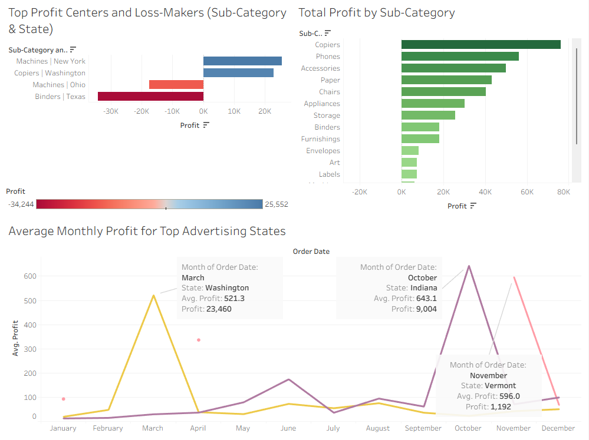

# 📊 Superstore Profitability Analysis (Tableau)

## 🔍 Project Overview
This project analyzes the Superstore dataset using Tableau to identify key profit and loss drivers, evaluate advertising opportunities, and assess product and customer return behavior.

## 🔗 Interactive Dashboard
[View on Tableau Public](https://public.tableau.com/views/SuperstoreProfitabilityAnalysis_17658678767250/TopProfitCentersandLoss-MakersSub-CategoryState?:language=en-US&:sid=&:redirect=auth&:display_count=n&:origin=viz_share_link)

## 📈 Key Insights
- Identified top-performing and underperforming sub-categories across states  
- Evaluated advertising opportunities using average monthly profit trends  
- Analyzed return patterns at both product and customer levels  

## 🛠️ Tools Used
- Tableau Desktop  
- Tableau Public  
- Superstore dataset  

## 👤 Author
Elizabeth Parr
